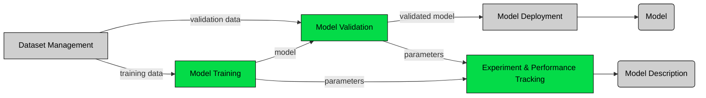

### Represented parts (green) in the [ai pipeline](https://github.com/DRAIVE/ai-pipeline-tools-poc)

# ai-pipeline-mlflow-poc

## Context

This is a proof of concept created to verify the MLFLow tool's functionality to handle the experiment tracking and comparison. The YOLOv5 object detection model is used here. LakeFS is used for accessing(S3) the versioned dataset for training, the dataset is downloaded using the AWS tool. The YOLOv5 repo is embedded as a git [subtree](https://gist.github.com/SKempin/b7857a6ff6bddb05717cc17a44091202) to this repo. The training and validation stages are handled using a DVC pipeline and mlflow handles the experiment tracking, experiment tracking and artifacts storage is achieved using a remote server.

## Usage

Steps:
- Clone the repo to a local machine
- Configure the awscli with lakefs credentials, using [awscli](https://docs.aws.amazon.com/cli/latest/userguide/getting-started-quickstart.html)
- Run the pipeline using 'dvc repro'
- Go to the remote tracking [server](http://jensen.etit.tu-chemnitz.de:9040) for reviewing and comparing the runs.
