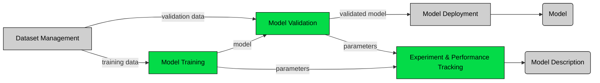

### Represented parts (green) in the [ai pipeline](https://github.com/DRAIVE/ai-pipeline-tools-poc)

# ai-pipeline-mlflow-poc

## Context

This is a proof of concept created to verify the MLFLow tool's functionality to handle the experiment tracking and comparison. The YOLOv5 object detection model is used here. LakeFS is used for accessing(S3) the versioned dataset for training, the dataset is downloaded using the AWS tool. The YOLOv5 repo is embedded as a sub-directory to this repo. The training and validation stages are handled using a DVC pipeline and mlflow handles the experiment tracking.

## Usage

Steps:
- Clone the repo to a local machine
- Configure the awscli with lakefs credentials, using [awscli](https://docs.aws.amazon.com/cli/latest/userguide/getting-started-quickstart.html).
- Do 'dvc pull' to download the dataset. (The version of the dataset corresponds to the commit of the repo)
- Comeback to main directory and run the pipeline using 'dvc repro'.
- Use mlflow [commands](https://mlflow.org/docs/latest/cli.html#mlflow-ui) to visualize different runs.
