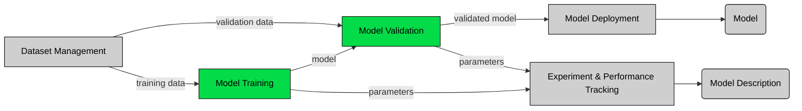

### Represented parts (green) in the [ai pipeline](https://github.com/DRAIVE/ai-pipeline-tools-poc)

# ai-pipeline-dvc-poc

## Context

This is a proof of concept created to verify the DVC tool's functionality to handle the training and validation of the machine learning models. The YOLOv5 object detection model is used here. Another DVC repo which was parallelly created to handle DVC for dataset management is used for accessing(S3) the versioned dataset for training. Both the YOLOv5 and DVC-dataset repos are added as submodules.

## Usage

Steps:
- Clone the repo to a local machine
- Go to the dvc-dataset submodule under data directory
- Add the s3 credentials using dvc [commands](https://dvc.org/doc/command-reference/remote/modify#--local)
- Do 'dvc pull' to download the dataset. (The version of the dataset corresponds to the commit of the repo)
- Comeback to main directory and run the pipeline using 'dvc repro'